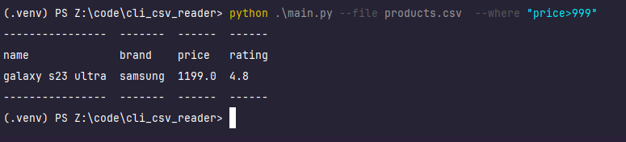
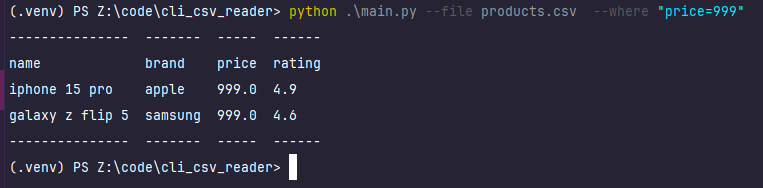
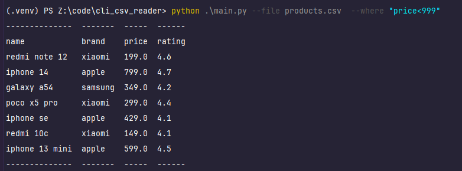
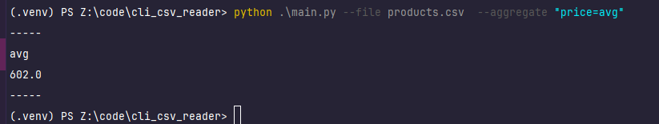
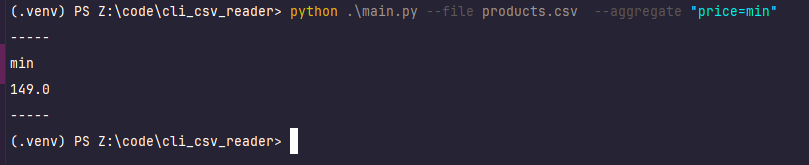
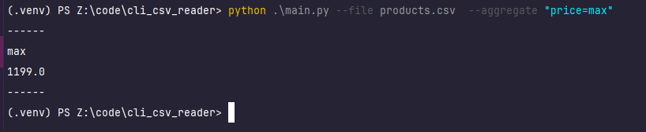
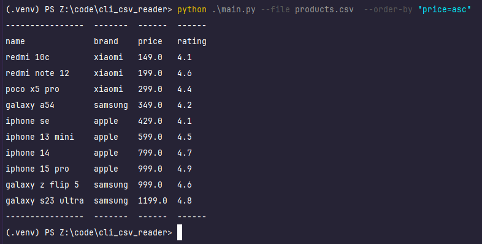
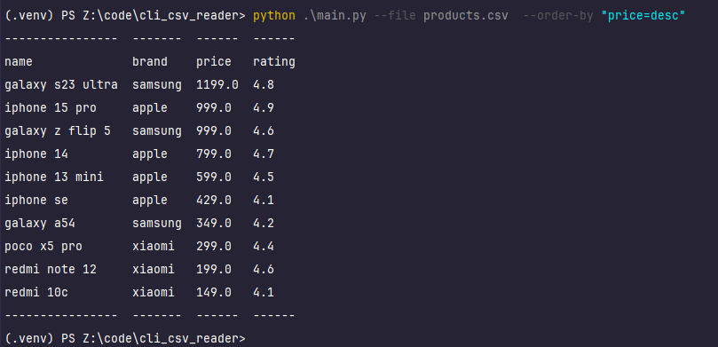
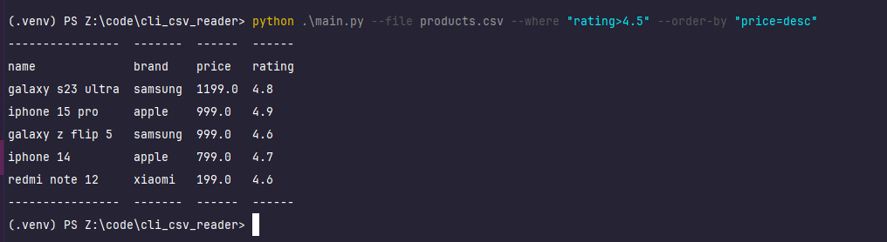

# Пример тестовых запусков
| name             | brand   | price | rating |
|------------------|---------|-------|--------|
| iphone 15 pro    | apple   | 999   | 4.9    |
| galaxy s23 ultra | samsung | 1199  | 4.8    |
| redmi note 12    | xiaomi  | 199   | 4.6    |
| iphone 14        | apple   | 799   | 4.7    |
| galaxy a54       | samsung | 349   | 4.2    |
| poco x5 pro      | xiaomi  | 299   | 4.4    |
| iphone se        | apple   | 429   | 4.1    |
| galaxy z flip 5  | samsung | 999   | 4.6    |
| redmi 10c        | xiaomi  | 149   | 4.1    |
| iphone 13 mini   | apple   | 599   | 4.5    |

## Where
### \>
> python .\main.py --file products.csv  --where "price>999" 

### =
> python .\main.py --file products.csv  --where "price=999" 

### \<
> python .\main.py --file products.csv  --where "price<999" 

## Aggregate
### avg
> python .\main.py --file products.csv  --aggregate "price=avg"  

### min
> python .\main.py --file products.csv  --aggregate "price=min"  

### max
> python .\main.py --file products.csv  --aggregate "price=max"  

## Order by
### asc
> python .\main.py --file products.csv --where "rating>4.2" --order-by "price=asc"  

### desc
> python .\main.py --file products.csv --where "rating>4.2" --order-by "price=desc"  

### + where
>  python .\main.py --file products.csv --where "rating>4.5" --order-by "price=desc" "  

